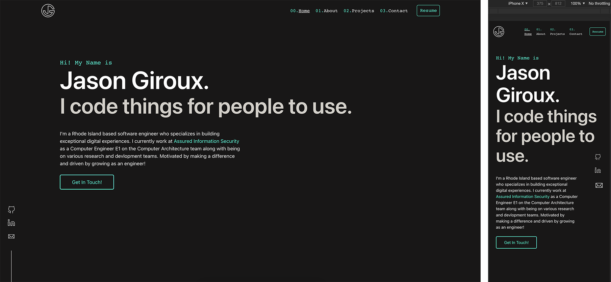

# Lets Jump Into It!
Demo Site: [jaysongitoux.github.io](https://www.jaysongiroux.github.io)\
Demo/build Branch: [gh-pages](https://github.com/jaysongiroux/jaysongiroux.github.io/tree/gh-pages)

## What does it look like?: 

## Available Scripts
* `yarn install` Install the dependencies 
* `yarn start` Runs the app in the development mode.
* Open [http://localhost:3000](http://localhost:3000) to view it in the browser.

The page will reload if you make edits.\
You will also see any lint errors in the console.